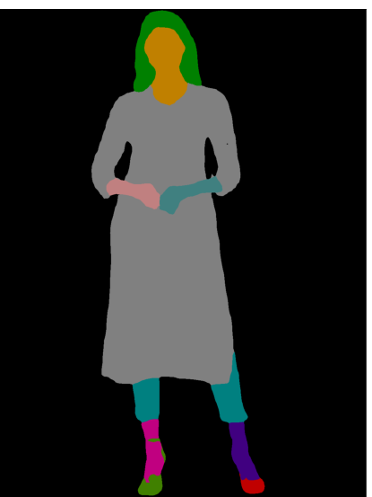
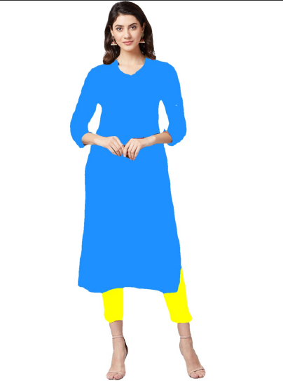

# Self-Correction for Human Parsing


## Requirements

```
conda env create -f environment.yaml
conda activate schp
pip install -r requirements.txt
```

## Dataset


**ATR** ([exp-schp-201908301523-atr.pth](https://drive.google.com/file/d/1ruJg4lqR_jgQPj-9K0PP-L2vJERYOxLP/view?usp=sharing))

* mIoU on ATR test: **82.29%**.

* ATR is a large single person human parsing dataset with 17000+ images. This dataset focus more on fashion AI. ATR has 18 labels, including 'Background', 'Hat', 'Hair', 'Sunglasses', 'Upper-clothes', 'Skirt', 'Pants', 'Dress', 'Belt', 'Left-shoe', 'Right-shoe', 'Face', 'Left-leg', 'Right-leg', 'Left-arm', 'Right-arm', 'Bag', 'Scarf'.


To extract the human parsing representation, simply put your own image in the `INPUT_PATH` folder, then download a pretrained model and run the following command. The output images with the same file name will be saved in `OUTPUT_PATH`

```
python simple_extractor.py --dataset 'atr' --model-restore [CHECKPOINT_PATH] --input-dir [INPUT_PATH] --output-dir [OUTPUT_PATH]
```


## Evaluation
```
python evaluate.py --model-restore [CHECKPOINT_PATH]
```
CHECKPOINT_PATH should be the path of trained model.


## Acknowledgement


latex
@article{li2020self,
  title={Self-Correction for Human Parsing},
  author={Li, Peike and Xu, Yunqiu and Wei, Yunchao and Yang, Yi},
  journal={IEEE Transactions on Pattern Analysis and Machine Intelligence},
  year={2020},
  doi={10.1109/TPAMI.2020.3048039}}


## Visualization

* Input Image


* Result after parsing



* Recoloured Output


